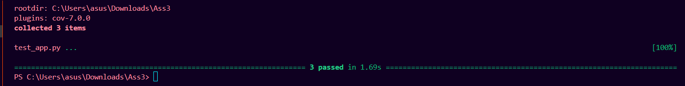

# Task Manager API

This documentation provides a comprehensive overview of the Task Manager API, a RESTful service built with Flask. It enables user registration and authentication, and allows users to manage tasks with full CRUD operations. The API uses JWT for authentication and supports pagination and filtering for task listings. This application is made on Python3.12. Although we can use docker to containerize the application.
---

## Project Structure & Purpose

The Task Manager API is structured into several Python modules, each with a specific responsibility:

| File Name        | Purpose |
|------------------|---------|
| `app.py`         | Application factory, Flask setup, configuration |
| `run.py`         | Entry point for running the application |
| `extensions.py`  | Database and JWT manager initialization |
| `routes.py`      | API route definitions and controllers |
| `users.py`       | User model definition |
| `tasks.py`       | Task model definition |
| `test_app.py`    | Application test cases |
| `requirements.txt`| Python package dependencies |
| `config.json`    | Application configuration settings |
---

## Requirements Installation

Before running the application, install all dependencies. (Ensure `requirements.txt` is populated with necessary packages such as Flask, Flask-SQLAlchemy, Flask-JWT-Extended, bcrypt, etc.)

```Command Line
pip install -r requirmenements.txt
```

---

## Quick Start

Run the API server with:

```bash
python run.py
```

The API will be available at:  
Base URL: http://localhost:6001

---

## Authentication

The API uses JWT for authentication.  
You must register and login to obtain a JWT token, then include it in the Authorization header for all protected endpoints.

Header format:
Authorization: Bearer <your_access_token>

---

 ## API Endpoints

Below you will find interactive API blocks for each endpoint, with details on parameters, requests, responses, and usage.

---
 ### Register a New User

#### Curl
```api
curl -X POST http://localhost:6001/register \
     -H "Content-Type: application/json" \
     -d '{
           "username": "newuser",
           "password": "strongpassword123"
         }'
```

#### Responses
```Json
{
  "201": { "message": "User created successfully" },
  "409": { "message": "User already registered" },
  "400": { "message": "Username and password are required" }
}

```

---

### Log In a User

#### Curl
```api
curl -X POST http://localhost:6001/login \
     -H "Content-Type: application/json" \
     -d '{
           "username": "newuser",
           "password": "strongpassword123"
         }'
```

#### Responses
```Json
{
  "200": {
    "access_token": "eyJhbGciOiJIUzI1NiIsInR5cCI6IkpXVCJ9..."
  },
  "401": {
    "message": "Invalid credentials"
  },
  "404": {
    "message": "User not registered"
  }
}

```

---

### Create a New Task

#### Curl
```api
curl -X POST http://localhost:6001/createTask \
     -H "Authorization: Bearer <token>" \
     -H "Content-Type: application/json" \
     -d '{
           "title": "Buy Groceries",
           "description": "Milk, Eggs, Bread",
           "completed": false
         }'
```

#### Responses
```Json
{
  "201": {
    "id": 1,
    "title": "Buy Groceries",
    "description": "Milk, Eggs, Bread",
    "completed": false,
  },
  "400": {
    "message": "Title is a required field"
  }
}

```
---

### Get All Tasks (with Pagination and Filtering)

#### Curl
```api
curl -X GET "http://localhost:6001/getAllTasks?page=1&limit=10&status=pending" \
     -H "Authorization: Bearer <token>"
```

#### Responses
```Json
{
  "200": [
    {
      "id": 1,
      "title": "Buy Groceries",
      "description": "Milk, Eggs, Bread",
      "completed": false,
      "created_at": "2024-06-19T10:00:00Z",
      "updated_at": "2024-06-19T10:00:00Z"
    }
  ]
}

```
---

### Get a Specific Task

#### Curl
```api
curl -X GET http://localhost:6001/getTask/<taskID> \
     -H "Authorization: Bearer <token>"

```

#### Responses
```
{
  "200": {
    "id": 1,
    "title": "Buy Groceries",
    "description": "Milk, Eggs, Bread",
    "completed": false,
    "created_at": "2024-06-19T10:00:00Z",
    "updated_at": "2024-06-19T10:00:00Z"
  },
  "404": {
    "message": "Invalid task_id or task not found"
  }
}
```
---

### Update a Task

#### Curl
```api
curl -X PUT http://localhost:6001/updateTask/1 \
     -H "Authorization: Bearer <token>" \
     -H "Content-Type: application/json" \
     -d '{
           "title": "Updated Task Title",
           "completed": true
         }'
```

#### Responses
```
{
  "200": {
    "id": 1,
    "title": "Updated Task Title",
    "description": "Milk, Eggs, Bread",
    "completed": true,
    "created_at": "2024-06-19T10:00:00Z",
    "updated_at": "2024-06-19T12:00:00Z"
  },
  "404": {
    "message": "404 Not Found: The requested URL was not found on the server."
  }
}

```

---

### Delete a Task


#### Curl
```api
curl -X DELETE "http://localhost:6001/deleteTask/123" \
-H "Authorization: Bearer <your_jwt_token>" \
-H "Content-Type: application/json"

```

#### Responses
```
{
  "200": {
    "message": "Task deleted successfully"
  },
  "404": {
      "message": "Task not found"
  }
}

```


## Data Model Overview

The API uses two main models: User and Task.

### Entity Relationship Diagram

- A user can have many tasks.
- Each task belongs to one user via the user_id foreign key.
- Only the owner of a task can access or modify it.

---

## Detailed File Explanations

### `app.py`

- Purpose: Central configuration and initialization.

---

### `run.py`

- Purpose: Ensures the database is initialized before serving requests.

---

### `extensions.py`

- Purpose: Avoids circular imports and centralizes extension setup.

---

### `test_app.py`

- Purpose: Application test cases.

---
### `users.py`

- Purpose: Stores users securely with hashed passwords.

---

### `tasks.py`

- Purpose: Represents tasks; each task belongs to a user.

---

### `routes.py`

Defines all API endpoints for user and task management.

- User Endpoints:
    - `/register` (POST): Creates a user.
    - `/login` (POST): Authenticates and returns a JWT token.

- Task Endpoints (JWT Protected):
    - `/createTask` (POST): Creates a new task.
    - `/getAllTasks` (GET): Lists tasks with pagination and filtering.
    - `/getTask/<int:task_id>` (GET): Fetches a task by ID.
    - `/updateTask/<int:task_id>` (PUT): Updates a task.
    - `/deleteTask/<int:task_id>` (DELETE): Deletes a task.

---

### `readme.md`

Contains summary usage documentation (see above for full interactive API reference).

---

### `enpoints.txt`

Provides sample cURL commands to interact with the API for testing and demonstration.

---

### `requirements.txt`

Should list all dependencies.  
Note: Remember to add all necessary packages for your environment as this file is currently empty.

---

## Testing

To run tests, use the following command in your terminal:

- This will automatically discover and run all test files (like test_*.py or *_test.py) in your project. Make sure pytest is installed (pip install pytest).

```
pytest

```



- Generate an HTML coverage report:

```
  pytest --cov=. --cov-report=html
```


---

## Notes

- Use JWT tokens for all protected endpoints.
- Only the owner of a task can manage it.
- Supports pagination and filtering by task status.
- Extendable for user roles and more advanced permissions.
